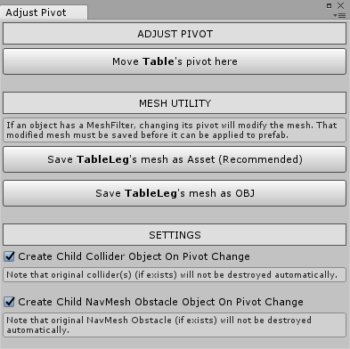

# Pivot Editor for Unity

**Available on Asset Store:** https://www.assetstore.unity3d.com/en/#!/content/112883

**Forum Thread:** https://forum.unity.com/threads/adjust-pivot-without-using-an-empty-parent-object-open-source.520178/

This script allows you to change the pivot point of an object without having to create an empty GameObject as the pivot point. There are two types of pivot adjustments:

**a.** If the object does not have a mesh (**MeshFilter**, to be precise), then the script simply changes the positions and rotations of child objects accordingly

**b.** If the object does have a mesh, then the script first creates an instance of the mesh, adjusts the mesh's pivot point by altering its vertices, normals and tangents, and finally changes the positions and rotations of child objects accordingly

*Not tested with SkinnedMeshRenderer.*

## Upgrading From Previous Versions
Delete *Editor/AdjustPivot.cs* (if exists) before upgrading the plugin.

## HOW TO
Simply import **AdjustPivot.unitypackage** to your project and open the *Adjust Pivot* window via the **Window-Adjust Pivot** menu.

To change an object's pivot point, you can create an empty **child GameObject** and move it to the desired pivot position. Then, you can press the **Move X's pivot here** button to move the parent object's pivot there. It is safe to delete the empty child object afterwards.

Note that if the object has a mesh (**option b**), to apply the changes to the prefab, you have to save the instantiated mesh to your project. Otherwise, the asset will be serialized in the scene and won't be available to the prefab. You have two options there:

- save the mesh as asset (**.asset**)
- save the mesh as OBJ (**.obj**)

Afterwards, you can safely apply your changes to the prefab.

There are a few options that may be helpful in certain circumstances:

- **Create Child Collider Object On Pivot Change**: imagine your object has a BoxCollider and you rotate the pivot by 45 degrees. A BoxCollider itself can not be rotated and therefore, your BoxCollider will no longer be aligned with your object. If you enable this option, however, a child object with a BoxCollider will be created and it will be aligned with your object properly. But be aware that the original BoxCollider will not be removed automatically to prevent any Inspector references to it from getting lost. You should remove the original BoxCollider manually

- **Create Child NavMesh Obstacle Object On Pivot Change**: if enabled, a child object with NavMesh Obstacle component will be created automatically when pivot changes. This child object will be aligned with your object properly
